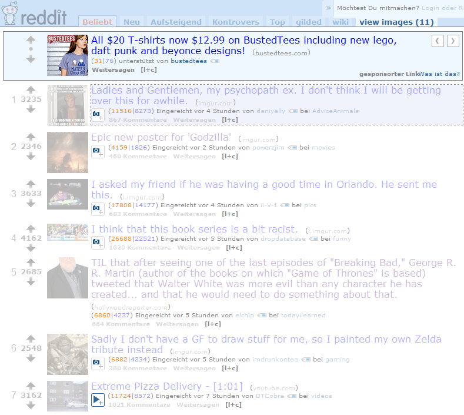
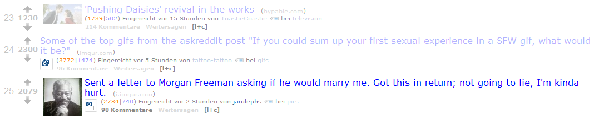

HistoryOfTheSeen
================

You know and use the history feature of your browser. This feature remembers the links you clicked. As a result you see them rendered differently from unvisited links (if not someone changes that).

But not only the decision to follow a link is rememberable but also the decision which links not to follow. 

Let's take a newspaper for an analogy. When you read a newspaper you skim over the pages, just scanning the headlines. Those which seem interesting probably lead you to read the article as well. So after you scanned the paper, you read a lot of headlines and some articles. And, more important, you know that you are finished with that specific issue of the newspaper.

Now let us take a look at a new "newspaper", e.g. reddit.

You can scan the frontpage and open some links (ok, who am I kidding ;) - but let us go on for the moment with some links) in new tabs. Those links on the frontpage change their color; you have visited them (at least the browser thinks so). So far the analogy with the newspaper holds.

So some time later you load the frontpage of reddit again. Here it is that the analogy breaks: Really new links which you have never seen before mix with visited links (colored) and old links you have decided not to follow.

Now of course you could just read every single link but that is not what I've in mind.

Deciding again which link to follow is cumbersome. That is where this Greasemonkey script helps a little bit.

# What the script does
If you load a page it remembers every link in the database of Greasemonkey. The next time you load the same page, all links which are already in the database are assumed to be seen by you already and are made transparent. Really new links shine out and can be easily identified.

The screenshots give a good impression how the script works:

##An unvisited reddit front page (as if that happens ;)

##The reddit front page after some visiting.

##After visiting the front page and revisiting it

##After visiting the front page with new links

Two links have already been seen but not been deemed clickworthy.

# What the script does, technically
It just goes through the a href elements, computes a hash and stores the hash. If it encounters a hash that already has been stored during loading, this link will be painted more transparently.

# Shortcomings

A lot. ;) This is the first crude version of this script and it is not very sophisticated. There are a lot of things which might be improved, as

* settings,
* hiding paragraphs and not only links,
* hiding links only after some time,
* remembering links only after some time,
* hiding a specific context of a link,
* and many more.

# License
The source is licensed under GPL v3 or later.
The md5 source is licensed under a MIT license (see license_md5.txt or 
<https://code.google.com/p/crypto-js/wiki/License>) is provided for convenience.
It could be loaded from the source with this statement as well:
@require http://crypto-js.googlecode.com/svn/tags/3.1.2/build/rollups/md5.js
This is not allowed everywhere (because of possible code alteration etc.) so that is why 
the code is here. 

# Remarks
Tested with Firefox 27.0.1 and GreaseMonkey 1.15
